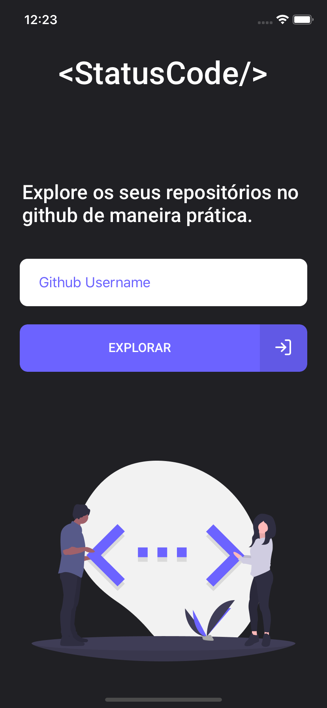
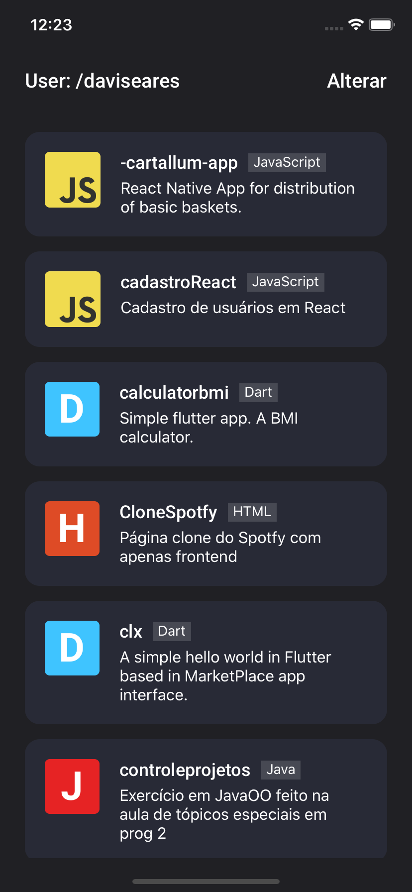
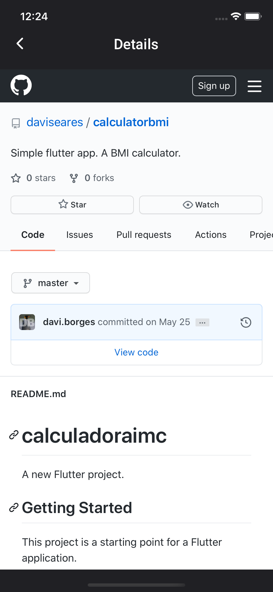

<h1 align="center">
    
</h1>

<p align="center">	  
  <a href="https://github.com/daviseares/status-code/commits/master">
    
  </a>
  
  

  
</p>

<br>

<p align="center">
  
   
    
</p>

## 🚀 Tecnologias

Esse projeto foi desenvolvido com as seguintes tecnologias:

- [TypeScript](https://www.typescriptlang.org/)
- [React Native](https://facebook.github.io/react-native/)
- [Expo](https://expo.io/)

## 💻 Projeto

Um aplicativo em React Native + Typescript para explorar repositórios utilizando api do github.

### Installation

```bash
# Clone this repository
$ git clone https://github.com/daviseares/status-code.git

# Go into the repository
$ cd status-code

# Install dependencies
$ npm install

# Run
$ expo start

# Expo will open, just scan the qrcode on terminal or expo page

# If some problem with fonts, execute:
$ expo install expo-font @expo-google-fonts/roboto

```


## 🤔 Como contribuir

- Faça um fork desse repositório;
- Cria uma branch com a sua feature: `git checkout -b minha-feature`;
- Faça commit das suas alterações: `git commit -m 'feat: Minha nova feature'`;
- Faça push para a sua branch: `git push origin minha-feature`.

Depois que o merge da sua pull request for feito, você pode deletar a sua branch.

## :memo: Licença

Esse projeto está sob a licença MIT. Veja o arquivo [LICENSE](LICENSE.md) para mais detalhes.

---

Feito com ♥ &nbsp;by Davi Borges.

